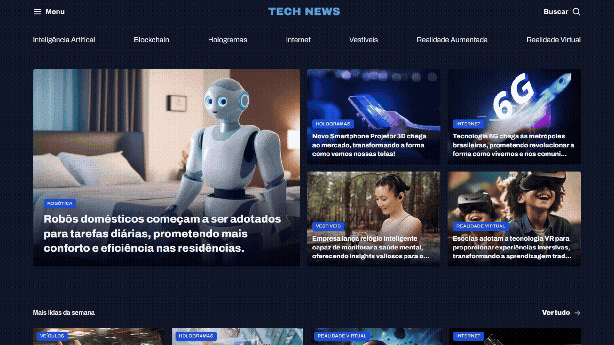

  

  Portal de notícias desenvolvido durante meus estudos de HTML e CSS na Rocketseat!

  <a href="#-tecnologias">Tecnologias</a>&nbsp;&nbsp;&nbsp;|&nbsp;&nbsp;&nbsp;
  <a href="#-projeto">Projeto</a>&nbsp;&nbsp;&nbsp;|&nbsp;&nbsp;&nbsp;
  <a href="#-o-que-pratiquei">O que pratiquei?</a> 

 

  

## 💻 Tecnologias

Esse projeto foi desenvolvido com:

* HTML
* CSS
* CSS Grid

## 📰 Projeto

Este projeto foi desenvolvido durante meus estudos de HTML e CSS na Rocketseat, com o objetivo de praticar meus conhecimentos em CSS Grid.

A proposta foi criar um portal de notícias, trabalhando a organização dos conteúdos, estrutura da página e disposição dos elementos utilizando Grid.

## 📝 O que pratiquei?

* Estruturação de páginas com HTML
* Estilização com CSS
* Criação de layouts utilizando CSS Grid
* Organização e posicionamento de elementos
